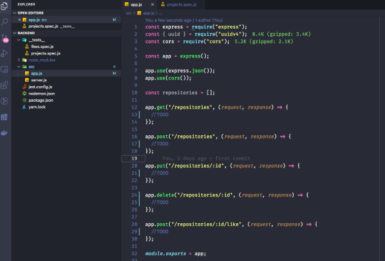
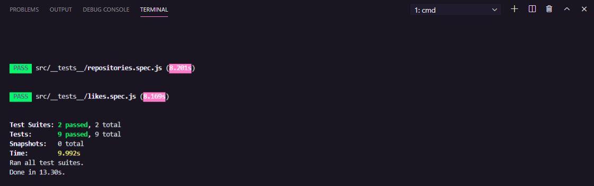
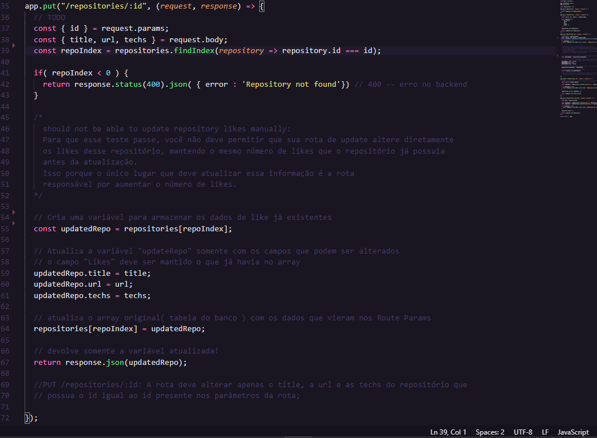
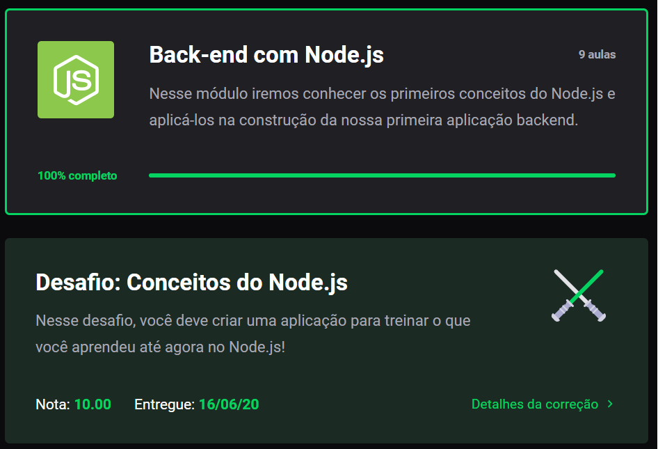

## desafio-conceitos-nodejs
Repositório para armazenamento do Desafio: Conceitos do NodeJs no Bootcamp GoStack

<h3 align="center">
  Desafio 02: Conceitos do Node.js
</h3>

<blockquote align="center">“Imagine uma nova história para sua vida e acredite nela.”!</blockquote>

  

  <a href="#rocket-sobre-o-desafio">Sobre o desafio</a>&nbsp;&nbsp;&nbsp;|&nbsp;&nbsp;&nbsp;
  <a href="#calendar-entrega">Entrega</a>&nbsp;&nbsp;&nbsp;|&nbsp;&nbsp;&nbsp;
  <a href="#memo-licença">Licença</a>

### :rocket: Sobre o desafio

Nesse desafio foi solicitada a criação de uma aplicação para treinamento do que foi aprendido no módulo "Conceitos: NodeJs!

A proposta da aplicação é possibilitar o armazenamento de repositórios do seu portfólio, permitindos criar, listar, atualizar e remover os repositórios, e além disso permitir que os repositórios possam receber "likes".

### Template da aplicação

Para ajudar nesse desafio inicial foi disponibilizado um modelo como um template do Github.

O template está disponível na seguinte url: **[Acessar Template](https://github.com/Rocketseat/gostack-template-conceitos-nodejs)**

**Dica**: Caso não saiba utilizar repositórios do Github como template, há um guia em **[nosso FAQ](https://github.com/Rocketseat/bootcamp-gostack-desafios/tree/master/faq-desafios).**

Na operação acima será realizada a criação de um novo repositório em seu GitHub através do modelo, sendo necessário realizar o "Clone" para o diretório em sua máquina.

Em seguida será necessário navegar até diretório criado,  abrir o Visual Studio Code e via terminal, executar o comando `yarn` no seu terminal para instalar todas as dependências.  
Estaremos diante de uma tela parecida com a imagem abaixo:

  

### Rotas da aplicação

Abrindo o arquivo app.js, foi necessário completar o código para atingir os objetivos de cada rota. 

- **`POST /repositories`**: A rota deve receber `title`, `url` e `techs` dentro do corpo da requisição, sendo a URL o link para o github desse repositório. Ao cadastrar um novo projeto, ele deve ser armazenado dentro de um objeto no seguinte formato: `{ id: "uuid", title: 'Desafio Node.js', url: 'http://github.com/...', techs: ["Node.js", "..."], likes: 0 }`; Certifique-se que o ID seja um UUID, e de sempre iniciar os likes como 0.

- **`GET /repositories`**: Rota que lista todos os repositórios;

- **`PUT /repositories/:id`**: A rota deve alterar apenas o `title`, a `url` e as `techs` do repositório que possua o `id` igual ao `id` presente nos parâmetros da rota;

- **`DELETE /repositories/:id`**: A rota deve deletar o repositório com o `id` presente nos parâmetros da rota;

- **`POST /repositories/:id/like`**: A rota deve aumentar o número de likes do repositório específico escolhido através do `id` presente nos parâmetros da rota, a cada chamada dessa rota, o número de likes deve ser aumentado em 1;

**Dica**: Acima utilizamos `POST` em uma rota, mesmo ela alterando o número de likes do repositório sem criar nada diretamente.

Se dividirmos semânticamente as responsabilidades da nossa aplicação em entidades, o `like` seria uma entidade, e `repository` seria outra entidade.

Com essa separação, temos diferentes regras de negócio para cada entidade, assim, ao chamar a rota de `like` e adicionamos apenas um like, podemos interpretar que estamos criando um novo like, e não atualizando os likes.

Então por que não usar `PUT` no lugar de `POST`? Justamente por estarmos "criando" UM novo like, e não atualizando o número de likes para qualquer outro valor.

Talvez fique difícil enxergar por ser apenas um número, mas pense que cada like seja salvo em uma tabela no banco junto do usuário que realizou esse like. Agora fica mais claro que você está criando um novo like, certo?

Bora Codar...

### Especificação dos testes

Em cada teste há uma breve descrição do que a aplicação deve cumprir para que o teste seja aprovado com sucesso.

Dúvidas com relação ao que são os testes, e como interpretá-los, podem ser esclarecidas em **[nosso FAQ](https://github.com/Rocketseat/bootcamp-gostack-desafios/tree/master/faq-desafios).**

Para esse desafio temos os seguintes testes:

- **`should be able to create a new repository`**: Para que esse teste passe, sua aplicação deve permitir que um repositório seja criado, e retorne um json com o projeto criado.

- **`should be able to list the repositories`**: Para que esse teste passe, sua aplicação deve permitir que seja retornado um array com todos os repositórios que foram criados até o momento.

- **`should be able to update repository`**: Para que esse teste passe, sua aplicação deve permitir que sejam alterados apenas os campos `url`, `title` e `techs`.

- **`should not be able to update a repository that does not exist`**: Para que esse teste passe, você deve validar na sua rota de update se o id do repositório enviado pela url existe ou não. Caso não exista, retornar um erro com status `400`.

- **`should not be able to update repository likes manually`**: Para que esse teste passe, você não deve permitir que sua rota de update altere diretamente os likes desse repositório, mantendo o mesmo número de likes que o repositório já possuia antes da atualização. Isso porque o único lugar que deve atualizar essa informação é a rota responsável por aumentar o número de likes.

- **`should be able to delete the repository`**: Para que esse teste passe, você deve permitir que a sua rota de delete exclua um projeto, e ao fazer a exclusão, ele retorne uma resposta vazia, com status `204`.

- **`should not be able to delete a repository that does not exist`**: Para que esse teste passe, você deve validar na sua rota de delete se o id do repositório enviado pela url existe ou não. Caso não exista, retornar um erro com status `400`.

- **`should be able to give a like to the repository`**: Para que esse teste passe, sua aplicação deve permitir que um repositório com o id informado possa receber likes. O valor de likes deve ser incrementado em 1 a cada requisição, e como resultado, retornar um json contendo o repositório com o número de likes atualizado.

- **`should not be able to like a repository that does not exist`**: Para que esse teste passe, você deve validar na sua rota de like se o id do repositório enviado pela url existe ou não. Caso não exista, retornar um erro com status `400`.

### Testes integrados

Foi utilizado o jest para validação dos scripts e aprovação dos detalhes exigidos acima.

Após implementar todas as rotas e validações corretamente, a contagem de "passed" será igual a 9, conforme imagem abaixo:

  

### Maior dificuldade encontrada no projeto:
- **`should not be able to update repository likes manually`**:

O desafio acima apresentou uma dificuldade maior pois exigia a criação de uma variável "updated" que armazenasse os dados de "title", "url" e "techs" do id informado na requisição, de modo que ao atualizar o array de repositórios, os likes não fossem alterados já que somente pela rota POST /repositories/:id/like deverá ser possível incrementar os valores do campo "likes".

O método put nesse caso ficou assim:

  

### :calendar: Entrega

O desafio foi entregue a partir da plataforma Skylab, através do envio do link do repositório. 
Como dia, após concluir o desafio, fazer um post no Linkedin e postar o código no Github é uma forma de demonstração de conhecimentos e esforços para evolução na carreira e oportunidades futuras.

### Desafio realizado e aprovado no Skylab!

Após validação dos testes integrados e entrega do desafio, após alguns minutos será exibida a mensagem abaixo no desafio:

  

### :memo: Licença

Esse projeto está sob a licença MIT. Veja o arquivo [LICENSE](LICENSE) para mais detalhes.

---

Feito com 💜 by RodrigoMonteiro :wave: [Entre na comunidade Discord!](https://discordapp.com/invite/gCRAFhc)
